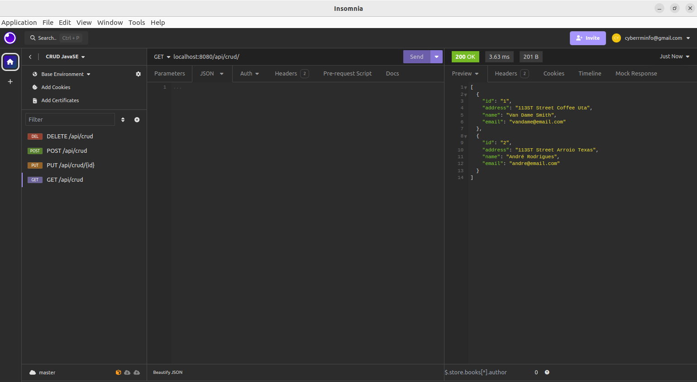

# CRUD System with HTTP Server in Java

This is a simple CRUD (Create, Read, Update, Delete) system implemented in Java using a native HTTP server, without the use of additional frameworks. It offers basic data manipulation operations in an XML file.

## Functionalities

- CREATE: Adds a new record to the XML file.


- READ: Retrieves all records from the XML file.


- UPDATE: Updates an existing record in the XML file.


- DELETE: Removes a record from the XML file.

The system was developed using native HTTP server classes provided by the ___com.sun.net.httpserver package___, which makes it lightweight and independent of external libraries.

## Implementation Details

- ___Native HTTP Server:___ The HTTP server is built using native Java classes, without the need for external frameworks. It listens for requests on a specific port and routes them to the security handler based on the URL path.


- ___XML manipulation:___ Data is stored in an XML file and manipulated using a DOM (Document Object Model) API provided by the org.w3c.dom package. This allows you to create, read, update and delete records within the XML file.

## Requirements

Java Development Kit (JDK) 8 or higher

## Endpoints

- POST /api/crud: Creates a new record.


- GET /api/crud: Returns all records.


- PUT /api/crud/{id}: Updates an existing record by ID.


- DELETE /api/crud/{id}: Removes a record by ID.

## How to Run

1. Clone this repository:
```
git clone https://github.com/seu_usuario/seu_repositorio.git
```

2. Navigate to the project directory:

```
cd your_repository
```

3. Compile the project (optional):
```
javac -d bin -sourcepath src src/org/crud/Main.java
```

4. Run the server:

```
java -cp bin org.crud.Main
```

## Create


## Update




## Delete


